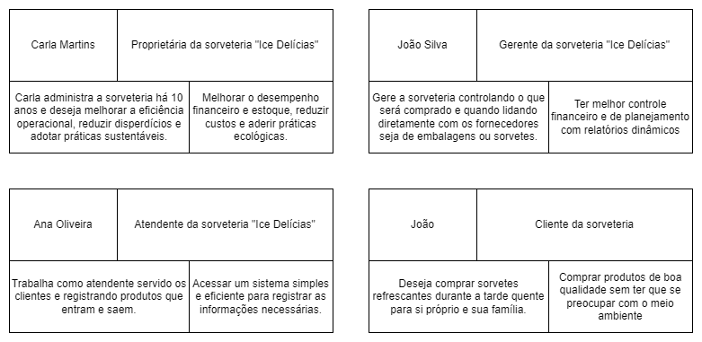
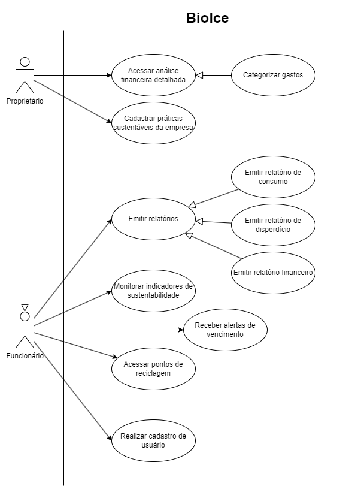

# Especificação do projeto

Pré-requisitos: <a href="01-Contexto.md"> Documentação de contexto</a>

Esta seção apresenta a especificação detalhada do projeto para a sorveteria "Ice Delícias". A definição do problema e a solução proposta são descritas a partir da perspectiva dos usuários.

Os principais elementos abordados incluem:

- Definição de personas
- Histórias de usuários
- Requisitos funcionais e não funcionais
- Restrições do projeto
- Diagrama de casos de uso

## Personas

1- Carla Martins

Idade: 35 anos

Profissão: Proprietária da sorveteria "Ice Delícias"

Perfil: Carla administra a sorveteria há 10 anos e deseja melhorar a eficiência operacional, reduzir desperdícios e adotar práticas sustentáveis.

Necessidades: Melhorar o controle financeiro e de estoque, reduzir custos e adotar práticas ecológicas.

2- João Silva

Idade: 28 anos

Profissão: Gerente da sorveteria

Perfil: Responsável pelo estoque e organização financeira. Utiliza sistemas básicos para registrar insumos, mas sente dificuldades em manter um controle preciso.

Necessidades: Um sistema eficiente para gerenciamento de estoque e finanças.

3- Ana Oliveira

Idade: 22 anos

Profissão: Atendente

Perfil: Trabalha na sorveteria e precisa registrar vendas e acompanhar o estoque.

Necessidades: Interface simples para registrar produtos vendidos e visualizar estoque.

4- Clientes da Sorveteria

Perfil: Frequentam a sorveteria regularmente.

Necessidades: Informações sobre promoções e incentivos à reciclagem.

### Diagrama

## Histórias de usuários

Com base na análise das personas, foram identificadas as seguintes histórias de usuários:

| EU COMO... `PERSONA`   | QUERO/PRECISO ... `FUNCIONALIDADE`                  | PARA ... `MOTIVO/VALOR`                                              |
|------------------------|-----------------------------------------------------|----------------------------------------------------------------------|
| **Administrador**      | Alterar permissões                                  | Permitir que outros administrem                                      |
| **Administrador**      | Cadastrar insumos no sistema                        | Controlar melhor o estoque                                           |
| **Administrador**      | Cadastrar produtos no sistema                       | Apoiar funcionários no registro de vendas                            |
| **Administrador**      | Excluir usuários no sistema                         | Tornar o acesso de ex-funcionários inacessíveis                      |
| **Administrador**      | Gerar relatórios de vendas                          | Identificar pontos fortes e elaborar melhorias                       |
| **Administrador**      | Realizar cadastro de novos usuários                 | Permitir acesso ao sistema a novos funcionários                      |
| **Funcionário**        | Alterar informações de vendas de produtos           | Corrigir possíveis erros após registrar vendas                       |
| **Funcionário**        | Cadastrar clientes                                  | Rastrear maiores consumidores e conceder descontos                   |
| **Funcionário**        | Registrar entrada e saída de insumos                | Manter controle atualizado                                           |
| **Funcionário**        | Registrar vendas de produtos                        | Obter rastreabilidade da saída de produtos e registro dos lucros     |

## Requisitos

As tabelas a seguir apresentam os requisitos funcionais e não funcionais que detalham o escopo do projeto. Para determinar a prioridade dos requisitos, aplique uma técnica de priorização e detalhe como essa técnica foi aplicada.

### Requisitos funcionais

| ID     | Descrição do Requisito  | Prioridade |
|--------|-----------------------------------------|---------|
| RF-001 | Permitir o cadastro, edição e exclusão de insumos no estoque | ALTA |
| RF-002 | Registrar a entrada e saída de insumos no estoque | ALTA |
| RF-003 | Gerar alertas automáticos para insumos próximos do vencimento | ALTA |
| RF-004 | Permitir o registro de receitas e despesas da sorveteria | ALTA |
| RF-005 | Categorizar os gastos para análise financeira detalhada | ALTA |
| RF-006 | Gerar relatórios financeiros para auxiliar na tomada de decisões | ALTA |
| RF-007 | Permitir o cadastro e gerenciamento de usuários com diferentes níveis de acesso | ALTA |
| RF-008 | Permitir que funcionários registrem movimentações de estoque sem acesso a configurações administrativas | ALTA |
| RF-009 | Enviar notificações sobre estoque baixo e produtos vencendo | ALTA |
| RF-010 | Monitorar em tempo real a quantidade de insumos disponíveis | MÉDIA |
| RF-011 | Fornecer relatórios sobre o desperdício de insumos ao longo do tempo | MÉDIA |
| RF-012 | Emitir alertas sobre despesas excessivas ou fora do padrão | MÉDIA |
| RF-013 | Permitir a definição de metas financeiras para controle do orçamento | MÉDIA |
| RF-014 | Fornecer métricas e indicadores sobre o impacto ambiental da sorveteria | MÉDIA |
| RF-015 | Permitir o cadastro de práticas sustentáveis adotadas pela empresa | MÉDIA |
| RF-016 | Gerar relatórios periódicos sobre controle de estoque, desempenho financeiro e práticas sustentáveis | MÉDIA |

### Requisitos não funcionais

|ID     | Descrição do Requisito  |Prioridade |
|-------|-------------------------|----|
|RNF-001| O sistema deve ser responsivo para rodar em dispositivos móveis | MÉDIA | 
|RNF-002| Deve processar as requisições do usuário em no máximo 3 segundos |  BAIXA | 
|RNF-003| O sistema deve permitir múltiplos acessos simultâneos sem perda de desempenho |  ALTA | 
|RNF-004| Os dados financeiros e de estoque devem ser armazenados com segurança e criptografia |  ALTA | 

## Restrições

Enumere as restrições à sua solução. Lembre-se de que as restrições geralmente limitam a solução candidata.

O projeto está restrito aos itens apresentados na tabela a seguir.

|ID| Restrição                                             |
|--|-------------------------------------------------------|
|001| O sistema deve funcionar em navegadores modernos (Chrome, Firefox, Edge), sem necessidade de instalação de software adicional. |
|002| A implementação deve ser concluída dentro do período letivo definido para a disciplina.      |
|003| O sistema deve ser desenvolvido utilizando tecnologias acessíveis e de fácil manutenção pela equipe.      |
|004| O banco de dados deve ser compatível com soluções gratuitas ou de baixo custo para viabilizar a implantação no cliente.      |
|005| As funcionalidades devem priorizar a simplicidade e usabilidade, garantindo que os funcionários da sorveteria consigam operar o sistema sem necessidade de treinamento avançado |

## Diagrama de casos de uso

O diagrama de casos de uso é o próximo passo após a elicitação de requisitos. Ele utiliza um modelo gráfico e uma tabela com as descrições sucintas dos casos de uso e dos atores. O diagrama contempla a fronteira do sistema e o detalhamento dos requisitos funcionais, com a indicação dos atores, casos de uso e seus relacionamentos.

