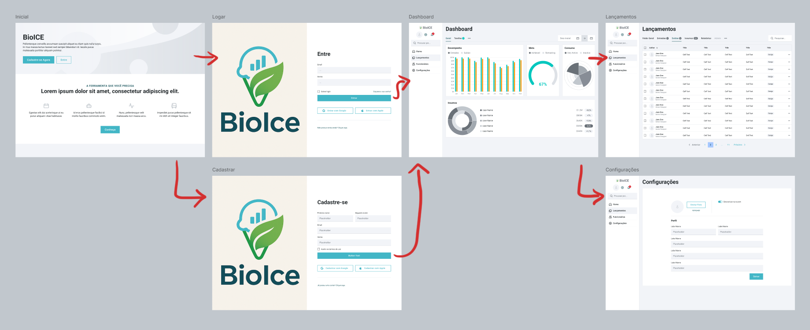
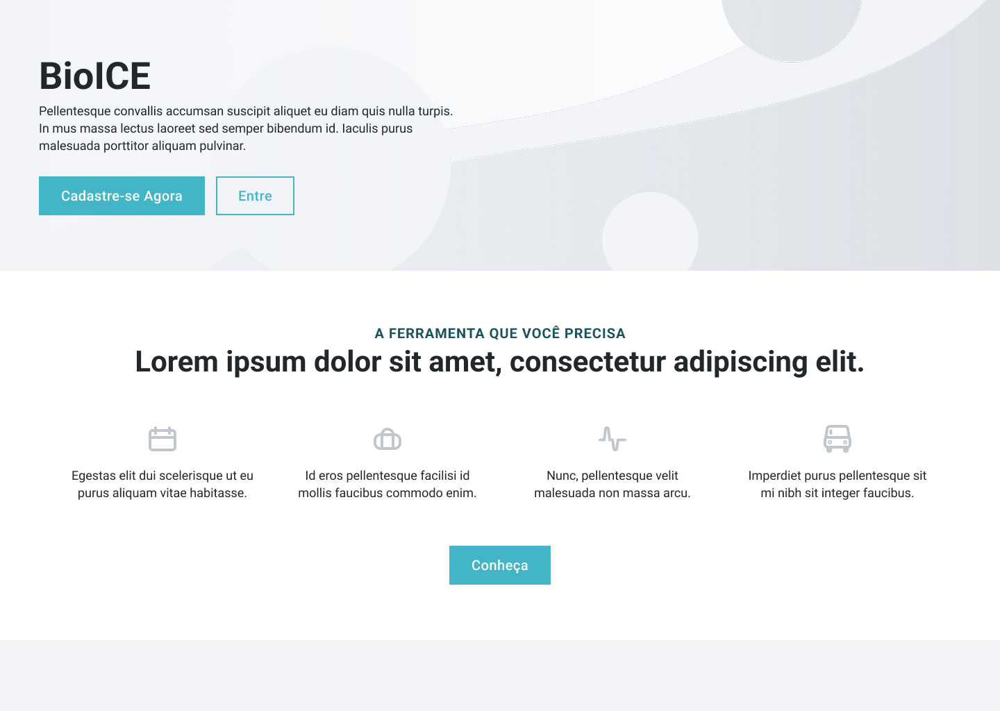
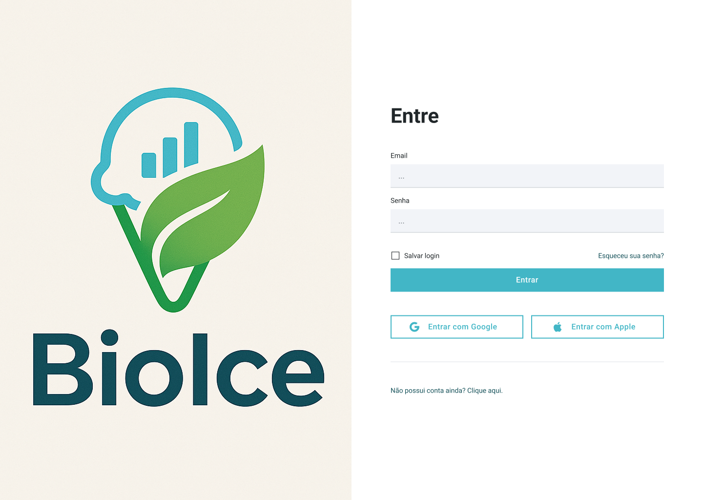
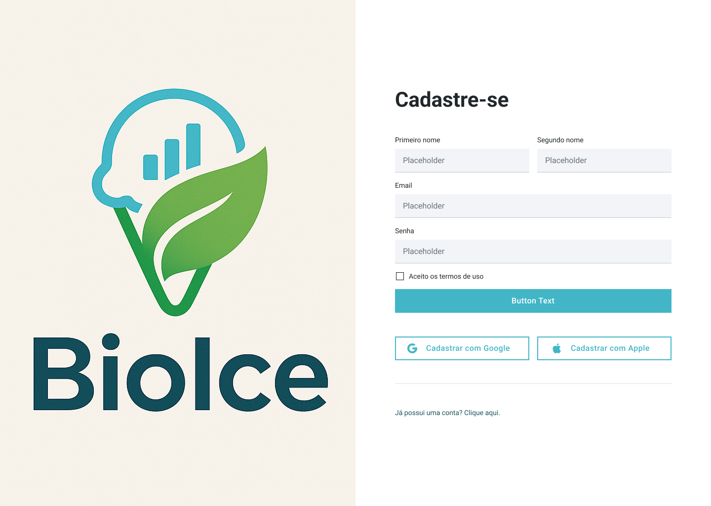
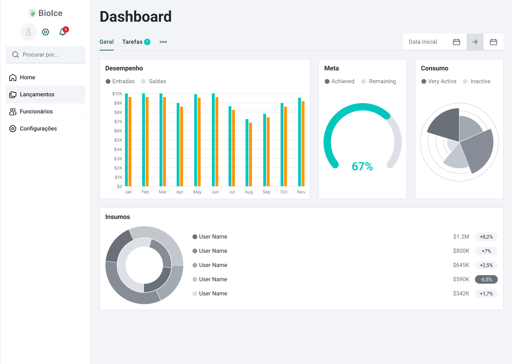
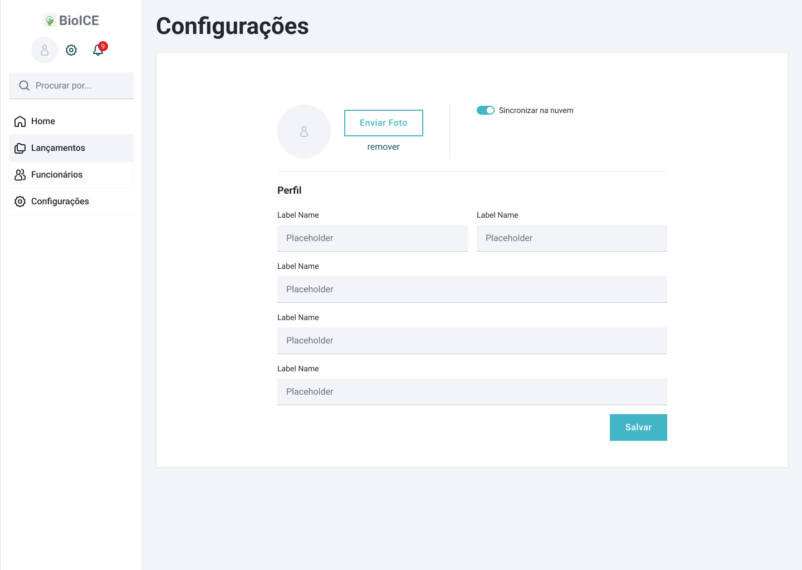

# Projeto de interface

Pré-requisitos: <a href="02-Especificacao.md"> Especificação do projeto</a>

 ## User flow

O usuário terá acesso inicialmente na aplicação a tela de apresentação do software que oferecerá uma forma de entrar na aplicação ou se cadastrar que direcionarão para as telas pertinentes. Destas telas ao fim do processo o usuário entrará na tela de dashboard onde poderá visualizar as informações de seu negócio e o informativo dos indicadores ecológicos cadastrados. No menu lateral será possível acessar um menu para cadastrar funcionários e lançamentos de vendas, compras, insumos e descartes. Também temos a tela das configurações onde será configurado o perfil do usuário e suas opções de salvamento dos dados.

### Diagrama de fluxo

O diagrama apresenta o estudo do fluxo de interação do usuário com o sistema interativo, muitas vezes sem a necessidade de desenhar o design das telas da interface. Isso permite que o design das interações seja bem planejado e tenha impacto na qualidade do design do wireframe interativo que será desenvolvido logo em seguida.

O diagrama de fluxo pode ser desenvolvido com “boxes” que possuem, internamente, a indicação dos principais elementos de interface — tais como menus e acessos — e funcionalidades, como editar, pesquisar, filtrar e configurar, além da conexão entre esses boxes a partir do processo de interação.

## Interface do sistema

Visão geral da interação do usuário por meio das telas do sistema. Apresente as principais interfaces da plataforma em sua versão final.

### Tela principal do sistema

Na tela inicial do sistema teremos uma breve introdução para novos clientes ou clientes que ainda não entraram em suas contas. Uma vez que o usuário entrar no sistema a aplicação salvará seus dados e a aplicação passará a sempre cair na tela de Dashboard.

### Tela de Login

Na tela inicial do sistema teremos uma breve introdução para novos clientes ou clientes que ainda não entraram em suas contas. Uma vez que o usuário entrar no sistema a aplicação salvará seus dados e a aplicação passará a sempre cair na tela de Dashboard.

### Tela de Cadastro

Na tela inicial do sistema teremos uma breve introdução para novos clientes ou clientes que ainda não entraram em suas contas. Uma vez que o usuário entrar no sistema a aplicação salvará seus dados e a aplicação passará a sempre cair na tela de Dashboard.

### Tela de Dashboard

Nesta tela o usuário pode rapidamente acompanhar seus registros financeiros e de estoque com os indicadores ecológicos.

### Tela de Lançamentos

Esta tela temos as tabelas com as informações do negócio para alimentar o dashboard, estes dados alimentam diretamente a base de dados da aplicação.

### Tela de Configurações

Aqui o usuário pode alterar as informações básicas do negócio e também configurar a conexão com serviços de persistência dos dados como por exemplo autorizar que os dados sejam salvos na núvem.

